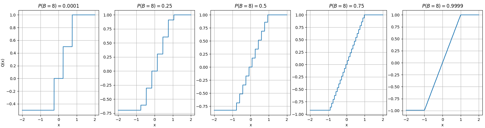
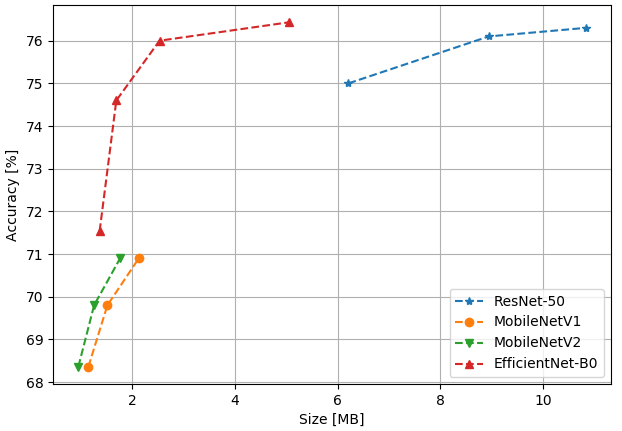

# HMQ: Hardware Friendly Mixed Precision Quantization Block for CNNs
This repository contains the auther's implementation of HMQ in PyTorch. 
## Abstrct
Recent work in network quantization produced state-of-the-art results using mixed precision quantization.
An imperative requirement for many efficient edge device hardware implementations is that their quantizers are uniform and with power-of-two thresholds.
In this work, we introduce the Hardware Friendly Mixed Precision Quantization Block (HMQ) in order to meet this requirement.
The HMQ is a mixed precision quantization block that repurposes the Gumbel-Softmax estimator into a smooth estimator of a pair of quantization parameters, namely, bit-width and threshold.
HMQs use this to search over a finite space of quantization schemes.
Empirically, we apply HMQs to quantize classification models trained on CIFAR10 and ImageNet. 
For ImageNet, we quantize four different architectures and show that, in spite of the added restrictions to our quantization scheme, we achieve competitive and, in some cases, state-of-the-art results.



 
## Install
Installation requirements via pip:
```
pip install requirements.txt
```
Also this repository requires the following packages:
1. apex:https://github.com/NVIDIA/apex (for multiple gpu and training on float16)
2. Weights and Biases for results loging (https://www.wandb.com/). 

## Running Training On ImageNet
Before you run the main.py for the first time, you will need to download and prepare the ImageNet data in the following way: All the data should be in one folder that is divide into two sub-folders:

1. train
2. validation 

where in each folder should  be order that ImageFolder dataset can read it.

The running command for retraining MobileNet V1 with HMQ on ImageNet dataset for Mixed Precision allow the following bit widths [8, 7, 6, 5, 4, 3, 2] 
```
python -m torch.distributed.launch --nproc_per_node=$NUM_GPU main.py --network_name mobilenet_v1 --lr_start 0.000005 --gamma 64 --lr_coefficient 0.005 --batch_size 256 --n_epochs 30 --target_compression 8.0 --fp16
```

 

## Contributing
If you find a bug or have a question, please create a GitHub issue.

